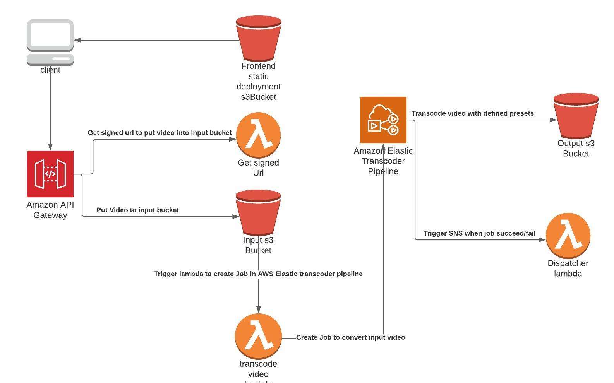

# video-transcoder to transcode videos to mp4 format

Change you profile with your AWS profile and similarly stage,regions, etc in serverless.yml file

Create AWS Elastic transcoder pipeline in AWS Console

change other variables like transcoder pipeline Id, presets etc according to your required deployment parameters

## TO DEPLOY serverless backend

sls deploy --stage <STAGE>

#Architectural diagram:

